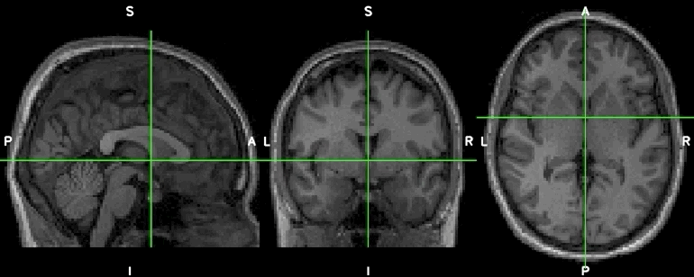

# 3D-Brain-Midsagittal-Flip



## Background
Originally developed for a stroke research project, this simple python script was used to flip 3D fMRI contrast images with lesions on the left side of the brain along the midline, so all lesions will be on the same side (right as the ipsilesional side in this case) for further analysis. 

## Generalization
The general idea of the function is to flip the left and right sides of an 3D image along the mid-plane on the x-axis. It was written in a way that can be directly applied to non-brain 3D images as well. 

## For Fellow Neuroscience Researchers 

**1. It is easy to use.**

* Runs entirely on Python and its dependencies. No installation of other software such as FSL, SPM, and ANTS is required.

**2. It supports batch processing.**

* Flips all images in a folder with just one line of code.

**3. It supports common medical and neuroimaging file formats.**
    
* ANALYZE, GIFTI, NIfTI1, NIfTI2, CIFTI-2, MINC1, MINC2, MGH, and Philips PAR/REC.

**4. It works well with different types of (spatially) normalized brain images.**

* T1 images, T2 images, t-maps, masks and more.


## Installation

Install Python3 and the following dependencies
```
pip3 install tqdm, nibabel
```

## Usage

The execution is designed to be as straight-forward as possible. It will process all the images in the `<input folder>` and store the flipped images in the `<outout folder>`.

1. Create an `<input folder>` to store all normalized<sup>*</sup> images waiting to be processed.
2. Create an `<output folder>` to store the processed images.
3. Run the python script using the following command line.

The python script provides a CLI (Command Line Interface) usage for this program. To execute it:
```
python3 flip.py <input_folder> <output_folder>
```
<sup>*</sup> Please make sure the input images are normalized to a standard space (for brain images) or make sure the plane-to-be-flipped sits on the midpoint of the chosen axis.


## Questions, Issues, and Feedback

https://www.hokifung.com/contact-me/

## License
MIT-licensed.
